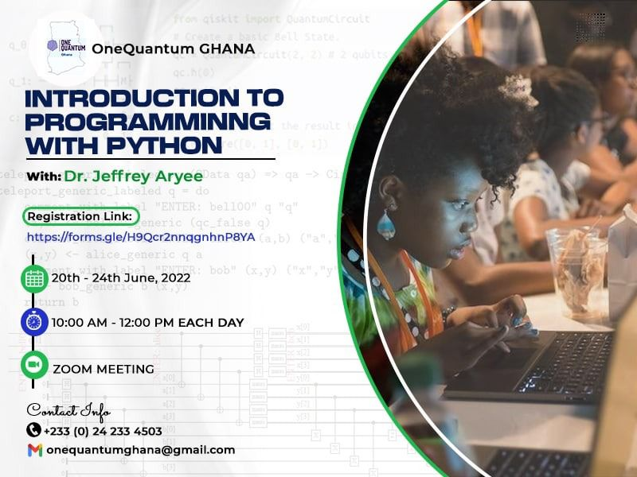

# ONEQUANTUM GHANA and PY4CA Joint Training on Introduction to Programming with Python 2022


Hi!

You're looking at the repository for the 20th to 24th June 2022 OneQuantum Ghana and PY4CA Joint Training on Introduction to Programming with Python..

The repository contains all the Jupyter notebooks which make up the course
training material (including exercises)

## Course overview

The course is scheduled for 10:00 UTC each day, and is expected to span 2 hours.


The course is taught over a number of sessions, with each session introducing a new set of topics. Each session has an associated Jupyter notebook (see below) which contains background information introducing you to the topic and a set of exercises for you to work through.

- Sunday:
  
  - installation

- Monday:
  
  - Data Types and Conditional Statement

- Tuesday:
  
  - Iterations and Loop Controls

- Wednesday:
  
  - numpy, scipy, matplotlib and cartopy

- Thursday:
  
  - pandas and seaborn

- Friday:
  
  - sympy


## Getting started

To work through the course you will need three things on your computer:

1. A copy of the course Jupyter notebooks
2. A copy of the datasets we’ll be working with
3. A conda environment with the necessary packages installed


### 1. Downloading the notebooks to your computer

The easiest way to get a copy of the notebooks on your computer is simply to clone this repository

```bash
$> git clone https://github.com/jeffjay88/OneQuantum-Ghana
$> cd https://github.com/jeffjay88/OneQuantum-Ghana
```

### 2. Download the datasets to your computer

All the datasets used in this course are included in the data directory.


You can now open up a Jupyter notebook session and get working on the notebooks.

```bash
$>jupyter notebook
```

We hope you enjoy the course!  
OneQuantum Ghana & PY4CA
 

|  |

| --------------------------- | ---------------------------- |


